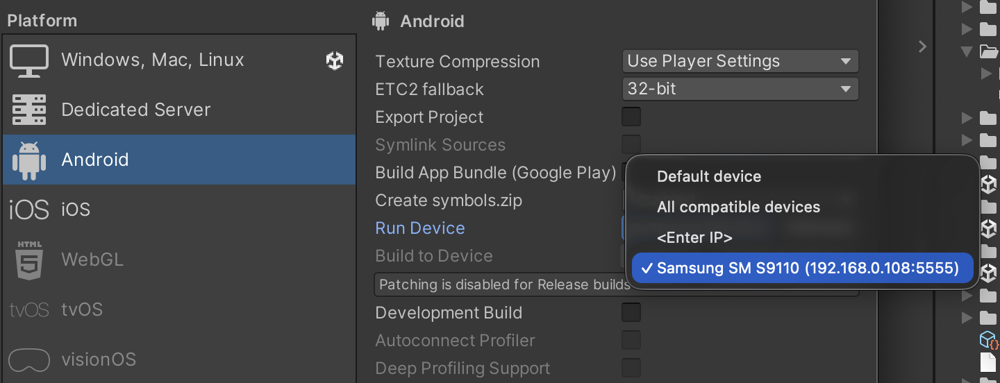

# Android Wireless Connect

无论是 Android 移动开发还是 XR 开发，无线连接都是调试、打包等工作中的高频需求，尤其是配合 Unity 等游戏引擎。

## 这是什么

一个通用 Agent Skill，帮助 Agent 通过 ADB 引导完成 Android 设备与电脑的无线连接，适用于 Android 开发、XR 开发过程中的无线调试、打包等。

## 安装

打开任意 Agent 终端，比如 Claude Code、Cursor 等，输入自然语言：

```text
帮我安装这个 Skill：https://github.com/ShaoWei-Dev/android-wireless-connect.git
```

## 如何使用

安装后，在支持 Skill 的 Agent 中直接用自然语言调用即可，例如：

- "帮我把手机无线连到电脑"
- "我要无线调试，帮我连一下手机"

具体执行流程由 Agent 读取 [SKILL.md](SKILL.md) 后引导完成。

另外，在 Cursor、Windsurf 等带有界面的 AI IDE 中，也可以通过对应的引用命令（如斜杠命令、`@skills` 等）对其进行调用。

## 验证

连接成功后，可在开发工具中找到通过无线连接的设备，以 Unity 为例，如下图所示：



## License

MIT

## 贡献

欢迎提交 Issue 和 Pull Request。
